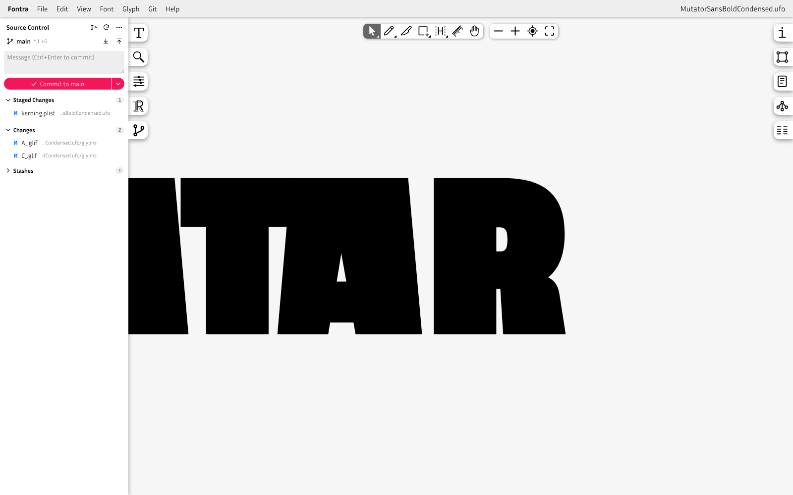
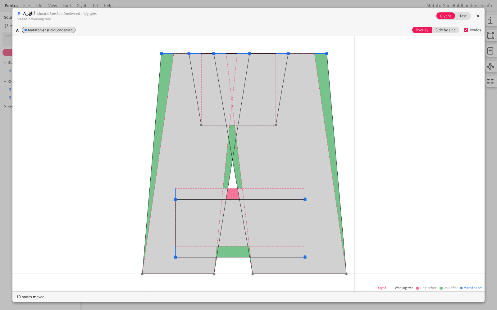
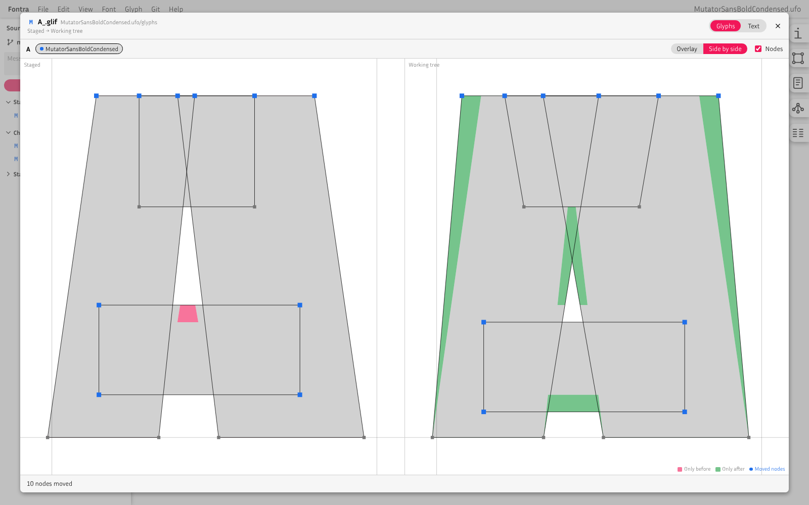
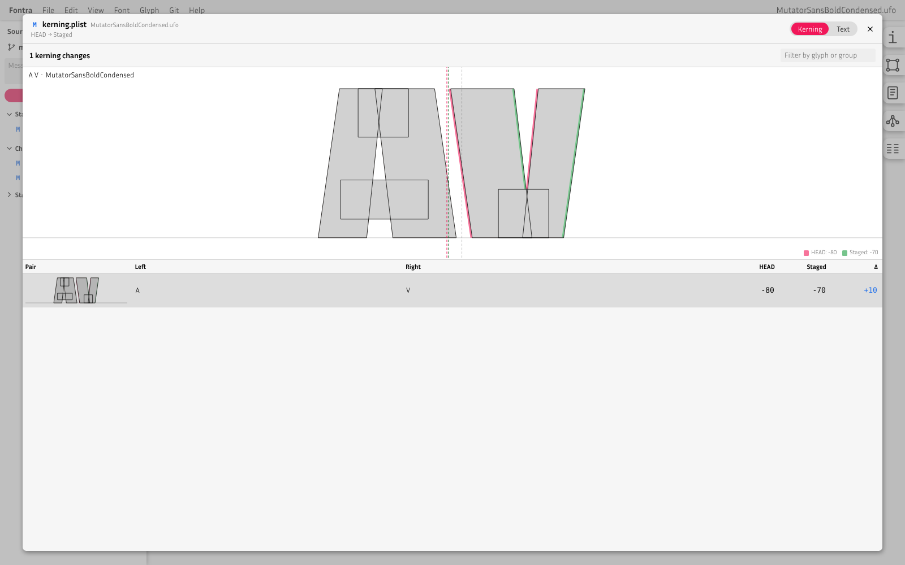
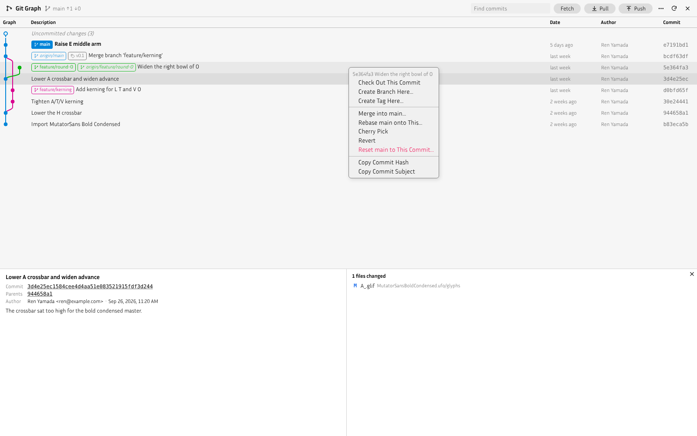

# Fontra Source Control

A [Fontra](https://github.com/fontra/fontra) plugin that brings Git into the glyph editor, similar to VS Code's Source Control view and the Git Graph extension.

- A **Source Control** panel in the left sidebar of the glyph editor: branch, commit message, staged and unstaged changes, merge conflicts and stashes
- Initialize a repository, stage, unstage, discard, commit (amend, commit & push, commit & sync), pull, push, fetch, stash, create, switch and merge branches
- Click a changed file to see the change **graphically**:
  - Glyph files are drawn with the area only the old version covers in red, the area only the new version covers in green and the shared area in gray. Moved nodes are blue. Overlay and side-by-side views use the same colors
  - Kerning files show a table of changed pairs, each drawn at its old and new spacing with the same fill colors
  - Every text file also has a line diff
- A **Git** menu in the menu bar, with a full-window **Git Graph**: the history of all branches in lanes, branch and tag labels, commit details with their changed files (opening the same graphical diff), and operations from context menus: checkout, create branch or tag, merge, rebase, cherry-pick, revert, reset, delete branch or tag
- Colors follow Fontra's light and dark themes
- The UI follows Fontra's display language (Application settings → Display Language), with every language Fontra has a translation for

| Source Control panel | Glyph diff (overlay) |
| --- | --- |
|  |  |
| **Glyph diff (side by side)** | **Kerning diff** |
|  |  |



## How it fits together

A Fontra plugin runs inside the browser, and a browser page is not allowed to run programs such as git. So this plugin comes in two parts:

- **The plugin**, which Fontra loads like any other plugin. It draws the panel, the diffs and the graph
- **The git bridge**, a small program that runs on your computer while you use Fontra and runs git for the plugin. It is a single Node.js script with no dependencies (`bridge/`)

```plaintext
Fontra (browser) ── plugin ──▶ git bridge (http://localhost:8765) ──▶ git ──▶ your font's repository
```

The plugin tells the bridge where the open font is, and the bridge finds the repository by looking for a `.git` folder in the folder that contains the font (the `.fontra`, `.ufo`, `.designspace` or `.glyphs` file or folder) and in the folders above it. With this layout:

```plaintext
MyFamily/
  .git/
  MyFamily.designspace
  MyFamily-Regular.ufo/
  MyFamily-Bold.ufo/
```

opening any of the fonts uses the `MyFamily` repository. If there is no repository yet, the panel offers to create one in the folder that contains the font.

## Setup

### What you need

| | Why | Check that it is installed |
| --- | --- | --- |
| [Fontra](https://fontra.xyz/) | | |
| [git](https://git-scm.com/downloads) | Does the actual version control | `git --version` |
| [Node.js](https://nodejs.org/) 22 or later | Runs the git bridge | `node --version` |

To check, open a terminal (macOS: **Applications → Utilities → Terminal**; Windows: **PowerShell** from the Start menu), type the command and press Return. A version number means it is installed.

- **macOS**: typing `git --version` offers to install the Command Line Developer Tools, which include git. Install Node.js with the installer from [nodejs.org](https://nodejs.org/) (the "LTS" version)
- **Windows**: install [Git for Windows](https://git-scm.com/download/win) and the Node.js installer from [nodejs.org](https://nodejs.org/). Open a new PowerShell window afterwards so it finds them

### Step 1: Start the git bridge

Paste this into the terminal and press Return:

```plaintext
npx --yes github:dg4-dev/fontra-source-control
```

The first time, it downloads the bridge from GitHub, which takes a few seconds. When it is ready, it prints:

```plaintext
Fontra git bridge is running on http://localhost:8765
It works with any font that Fontra opens.
Keep this window open while you use Fontra. Press Ctrl+C to stop.
```

**Keep this terminal window open** while you use Fontra; closing it stops the bridge. Each time you want to use the plugin, run the same command again. To stop the bridge, press Ctrl+C in its window or close the window.

`npx` comes with Node.js; nothing else needs to be installed. To use the bridge of a particular release, add its tag: `npx --yes github:dg4-dev/fontra-source-control#v0.1.0`.

### Step 2: Add the plugin to Fontra

In Fontra, choose **Fontra → Plugin Manager** in the menu bar (Application settings → Plugin Manager), press "+" and enter:

```plaintext
dg4-dev/fontra-source-control
```

Then open (or reload) a font in the glyph editor.

### Step 3: Open the Source Control panel

Click the branch icon in the left sidebar of the glyph editor.

- If it says **"The git bridge is not running"**, go back to step 1. The panel has a button to copy the command
- If it says **"…is not a git repository"**, press **Initialize Repository** to create one in the folder that contains the font
- Otherwise you see your changes. Type a message and press **Commit**

### Step 4 (optional): Connect to GitHub or another server

1. Create an empty repository on GitHub (no README, no license, so that it has no commits)
2. In the panel, choose **⋯ → Add Remote…**, keep the name `origin` and paste the repository's URL
3. Press the push button (↑) in the branch row

The bridge uses your computer's normal git login, but **git is not allowed to ask for a password through the bridge**. If you have never pushed to GitHub from this computer, set up a login once:

- Install [GitHub CLI](https://cli.github.com/) and run `gh auth login`, or
- Use [GitHub Desktop](https://desktop.github.com/) and push once from it, or
- Set up an [SSH key](https://docs.github.com/en/authentication/connecting-to-github-with-ssh) and use the repository's SSH URL (`git@github.com:…`)

You can check that it works by running `git push` in the font's folder in a terminal: if it pushes without asking for anything, the bridge can push too.

### Bridge options

Add these after the command, for example `npx --yes github:dg4-dev/fontra-source-control --port 9000`.

| Option | Description |
| --- | --- |
| `FOLDER` | Only work with fonts inside this folder, for example `npx --yes github:dg4-dev/fontra-source-control ~/Fonts`. Without it, the bridge works with any font Fontra opens |
| `--port N` | Port to listen on (default 8765). Also set the plugin's bridge address to match: **Git → Bridge Settings…** in the menu bar |
| `--host HOST` | Address to listen on (default 127.0.0.1) |
| `--allow-origin URL` | Also accept requests from this origin (repeatable). Pages on `localhost`, `127.0.0.1` and `[::1]` are always accepted |
| `--quiet` | Do not log each request |

From a local copy of this repository, use `node bridge/cli.js` with the same options.

### Troubleshooting

| What you see | What to do |
| --- | --- |
| "The git bridge is not running" | Start the bridge (step 1) and press **Retry**. If it is running on another port, set **Git → Bridge Settings…** to match |
| `Port 8765 is already in use` in the terminal | A bridge is already running (look for another terminal window), or another program uses the port: add `--port 9000` and change the bridge address in Bridge Settings |
| `npx: command not found` / `node` is not recognized | Node.js is not installed, or the terminal was opened before installing it. Install Node.js and open a new terminal window |
| "git was not found" | Install git (see "What you need") and restart the bridge |
| "The git bridge could not work with this font" with `outside the bridge's folder` | The bridge was started with a folder and the font is not inside it. Start it without a folder, or with a folder that contains the font |
| Push or pull fails with an authentication error | Set up a git login once (step 4) |
| A pull or checkout changed files but Fontra still shows the old glyphs | Reload the editor page. UFO, designspace and `.fontra` fonts reload by themselves |

### Plugin address for development branches

Fontra loads `owner/repo` addresses through jsDelivr (`https://cdn.jsdelivr.net/gh/<owner>/<repo>@latest`), so the repository must be public. `@latest` points to the newest release tag, or to the default branch (`main`) when there are no tags.

To try a development branch, enter a URL with the branch name.

```plaintext
https://cdn.jsdelivr.net/gh/dg4-dev/fontra-source-control@develop
```

jsDelivr caches branch contents for a while, so updates may not show up right away.

### From a local copy (for development)

Serve your working copy with CORS headers and register its URL as the plugin address. Your edits are picked up each time you reopen the editor.

```plaintext
npx http-server /path/to/fontra-source-control -p 8123 --cors -c-1
```

```plaintext
http://localhost:8123
```

Start the bridge from the same copy with `node bridge/cli.js`.

## Usage

### Source Control panel

A Source Control tab (branch icon) is added to the left sidebar of the glyph editor.

| Part | Description |
| --- | --- |
| Branch row | Current branch and how far it is ahead (↑) of or behind (↓) its upstream. Click it to switch branches, create a branch or merge. The two buttons pull and push |
| Message box | Commit message. Ctrl+Enter (⌘+Enter) commits |
| Commit button | Commits the staged changes. When nothing is staged, it offers to stage everything (including new files) and commit. The ▾ menu has Commit & Push, Commit & Sync and Commit (Amend) |
| Merge Changes | Files with conflicts. Resolve them, press + (Mark as Resolved), then Continue in the banner above. Abort goes back to the state before the merge, rebase, cherry-pick or revert |
| Staged Changes / Changes | Click a file to see its diff. Hover for stage (+), unstage (−) and discard (↶); right-click for the same actions |
| Stashes | Click a stash to list its files and open their diffs; the buttons apply, pop and drop it |
| ⋯ menu | Pull, push, force push (`--force-with-lease`), fetch, sync, branches, stash, remotes, bridge settings |

The panel checks the repository every few seconds while it is open (Bridge Settings → "Check for changes every few seconds").

Fontra writes edits to disk shortly after they are made, so they show up as changes in the panel. After a pull, checkout, merge or stash changes files on disk, Fontra reloads them for the UFO/designspace and `.fontra` formats, which watch their files.

### Diff view

| Control | Description |
| --- | --- |
| Glyphs / Kerning / Text tabs | The graphical view (when the file is a glyph or kerning file) and the line diff |
| Layer chips | One per layer or source. A dot shows whether the layer was added (green), deleted (red), changed (blue) or not changed (gray) |
| Overlay / Side by side | Overlay draws both versions on top of each other; side by side draws the old version on the left and the new one on the right with the same colors |
| Nodes | Shows nodes and handles. Moved nodes are blue; nodes found only in one version are circled red (old) or green (new) |
| Mouse | Wheel to zoom, drag to pan, double-click to fit. Side-by-side views pan and zoom together |

Supported for graphical diffs:

| Format | Glyphs | Kerning |
| --- | --- | --- |
| UFO (`.ufo`, also inside `.designspace` projects) | `glyphs*/*.glif` | `kerning.plist`, `groups.plist` |
| Fontra (`.fontra`) | `glyphs/*.json` | `kerning.csv` |
| Glyphs (`.glyphs`) | every changed glyph in the file | `kerningLTR` (Glyphs 3), `kerning` (Glyphs 2) |
| Glyphs package (`.glyphspackage`) | `glyphs/*.glyph` | `fontinfo.plist` |

Components are drawn by reading their base glyphs from the same version of the font. For kerning groups, the first glyph of the group is drawn; the table lists all members.

### Git Graph

**Git → Git Graph** in the menu bar (or the graph button in the panel) opens the graph over the whole window. Escape closes it.

- Click a commit to see its message, parents, author and changed files; click a file to open its diff against the first parent
- The top row shows uncommitted changes when there are any
- Right-click a commit: check out, create a branch or tag here, merge into the current branch, rebase the current branch onto it, cherry-pick, revert, reset the current branch to it (soft, mixed or hard), copy its hash or subject
- Right-click a branch or tag label: check out, merge, rebase, rename, delete, push a tag. Double-click a branch label to check it out
- The search box dims commits whose hash, subject or author do not match

### Display language

The plugin reads the display language that Fontra stores in localStorage (`fontra-language-language`) and uses the translation for that language code. Languages without a translation show English. Fontra reloads the page when its display language changes, and the plugin switches language at the same time.

| Language | Translated |
| --- | --- |
| English, 简体中文, 繁體中文, 日本語, Deutsch, Nederlands, Français, Italiano, Español (España), Español (Latinoamérica), Português (Brasil), Português (Portugal), Русский | Yes |
| Tagalog | No (shown in English) |

Terms that also appear in Fontra, such as "component", "anchor", "contour", "layer" and "advance width", follow Fontra's own translations.

## How it works

- **Finding the font**: the plugin asks Fontra for the open font's absolute path (`getMetaInfo()`, which Fontra's filesystem project manager answers with the path) and sends it with every request. When that is not available it sends the project identifier from the editor URL, which the bridge resolves the way Fontra's filesystem project manager does. The bridge only accepts paths of font projects (`.designspace`, `.ufo`, `.fontra`, `.glyphs`, `.glyphspackage`, `.rcjk`, and the binary formats Fontra opens)
- **Bridge**: every request is a POST to `/api/<command>` with a JSON body. The bridge opens the repository that contains the font, validates every path and revision name, and runs git with an argument list (no shell), `GIT_TERMINAL_PROMPT=0` and literal pathspecs. Commands that change the repository run one at a time per repository
- **Security**: the bridge listens on 127.0.0.1 and only answers requests whose `Host` is a local name (against DNS rebinding) and whose `Origin`, if any, is a local page or one passed with `--allow-origin`. Requests must be `application/json`, so browsers always send a CORS preflight
- **Diffs**: the bridge returns both versions of a file (from a commit, the index or the working tree) and a unified diff made with `git diff --no-index`. Glyph and kerning files are parsed in the browser (`src/formats/`); the fill colors come from SVG masks: the old shape masked by the outside of the new shape is red, the new shape masked by the outside of the old shape is green
- **Graph**: `git log --branches --tags --remotes HEAD --date-order` is laid out in lanes (`src/graph-layout.js`). A lane keeps its column while it lives and freed columns are reused

## Limitations

- The bridge has to be started separately, because a browser plugin cannot start programs. Fontra has no way for plugins to run code on its server
- Only tested with Fontra started from the command line (`fontra filesystem …`). Fontra Pak should work the same way but has not been tested
- The menu bar menu and the sidebar panel rely on internal APIs of Fontra's editor (`editor.addSidebarPanel()`, the menu bar's item list and others). Changes in Fontra may break them
- Interactive rebase, submodules, worktrees, blame and partial (line-by-line) staging are not supported
- `.glyphspackage` glyph files are found by a guess of their file names (the UFO convention), so components and kerning glyphs may not be drawn for some names
- Fontra's own undo history is not aware of git; after a checkout or pull, undo works on the reloaded glyphs

## Development

```plaintext
plugin.json            Fontra plugin metadata
bridge/
  cli.js               Command line entry point of the git bridge
  server.js            HTTP API, origin and host checks
  repository.js        Git operations and input validation
  git.js               Runs git
  parse.js             Parsers for git's machine-readable output
  project.js           Fontra project identifier → folder
src/
  start.js             Plugin entry point (init / function in plugin.json)
  bridge-client.js     Requests to the bridge, shared repository state
  git-actions.js       Operations with their dialogs and messages
  graph-layout.js      Lane layout of the commit graph
  unified-diff.js      Unified diff parser
  settings.js          Settings store, saved to localStorage
  strings.js           Display language lookup
  lang/                UI strings, one file per Fontra display language
  formats/             Glyph, kerning, plist and XML readers, glyph diff (no Fontra or DOM dependencies)
  ui/                  Sidebar panel, diff view, graph view, menu, drawing and DOM helpers
test/                  Unit tests with node:test; bridge tests run git in temporary repositories
docs/images/           Screenshots
```

Run the tests (Node.js 22 or later and git, no dependencies):

```plaintext
npm test
```

Format with [Prettier](https://prettier.io/) using `.prettierrc.json`.

### Branching

The repository follows git-flow.

- `main`: released code. jsDelivr's `@latest` loads this branch when there are no tags
- `develop`: integration branch for the next release
- `feature/*`: one branch per feature, branched from `develop` and merged back into `develop`
- `release/*`: release preparation, branched from `develop`, merged into both `main` and `develop`, with a tag on `main`

## License

[GNU General Public License v3.0](LICENSE) (GPL-3.0), the same license as Fontra.
